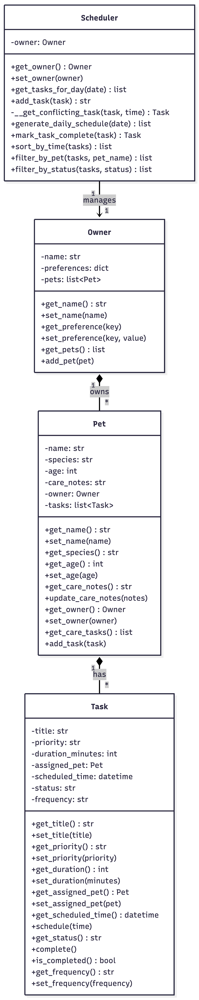
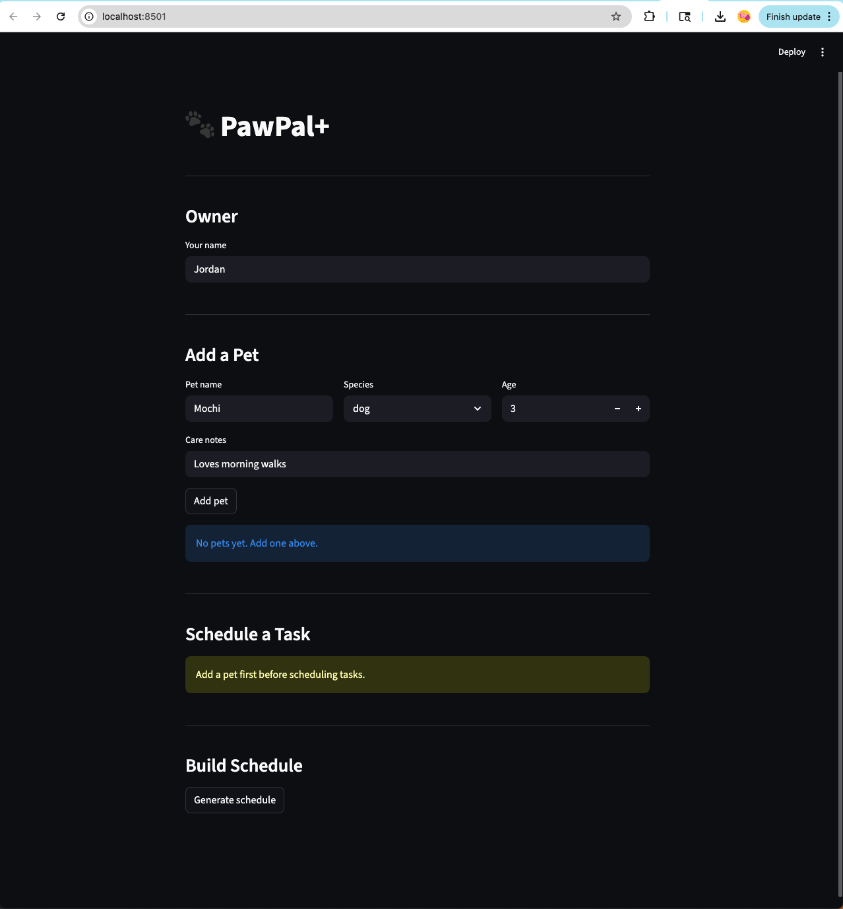
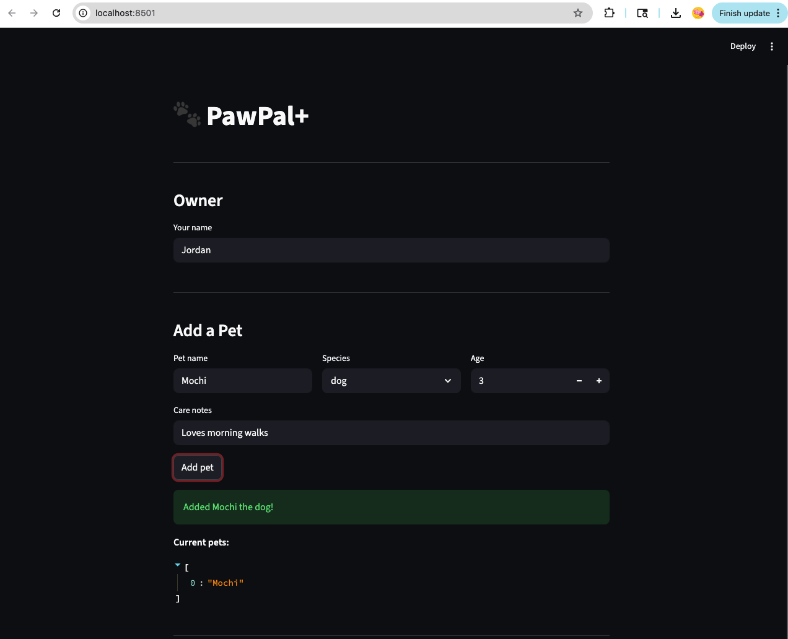
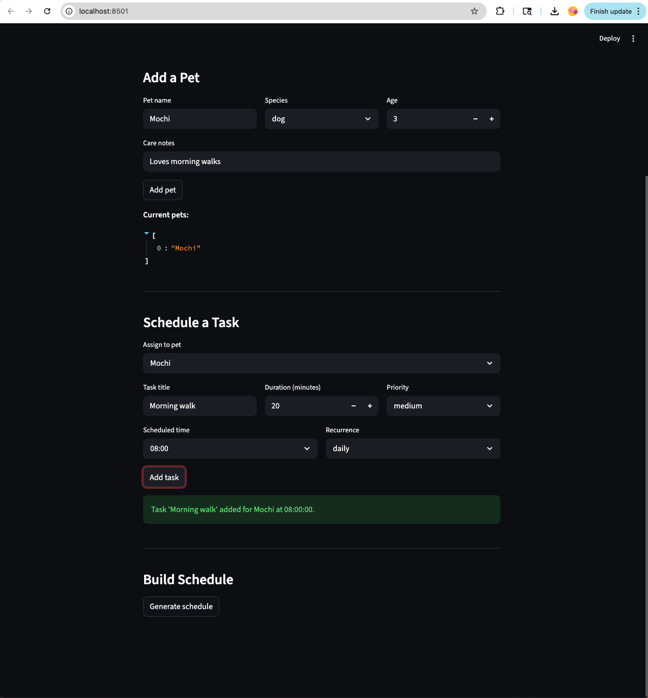
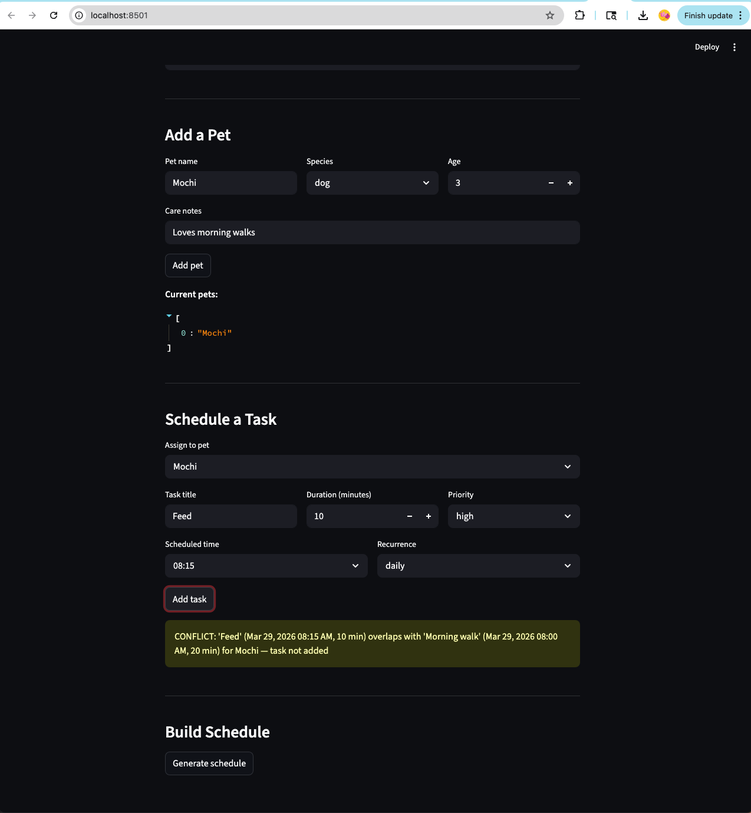
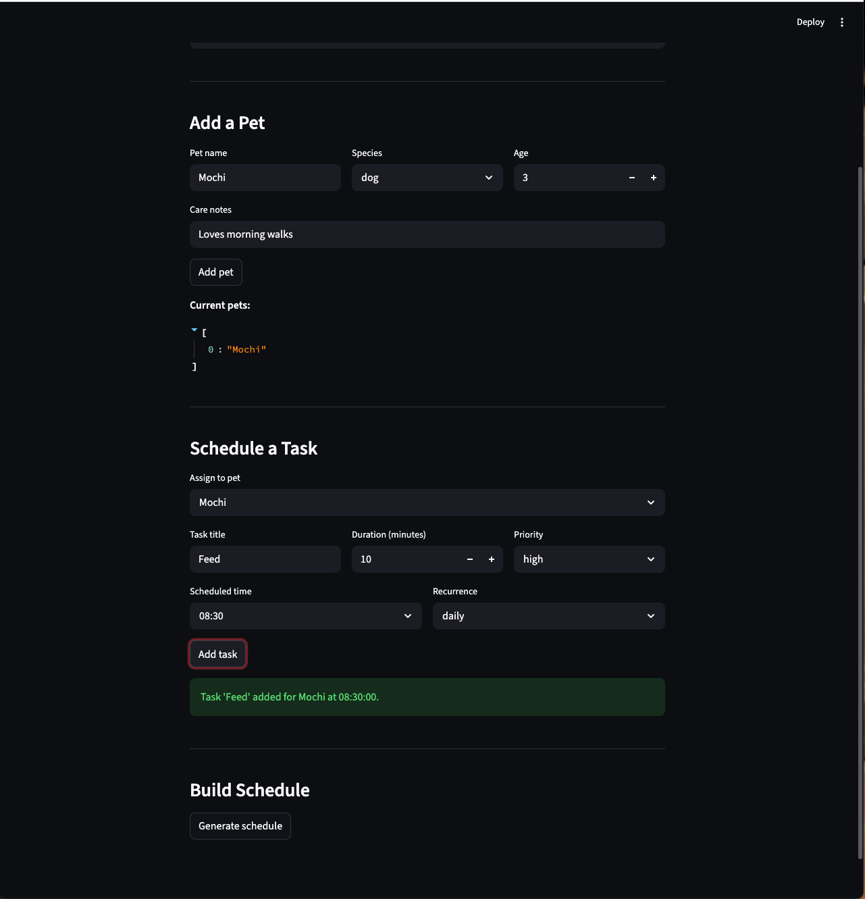
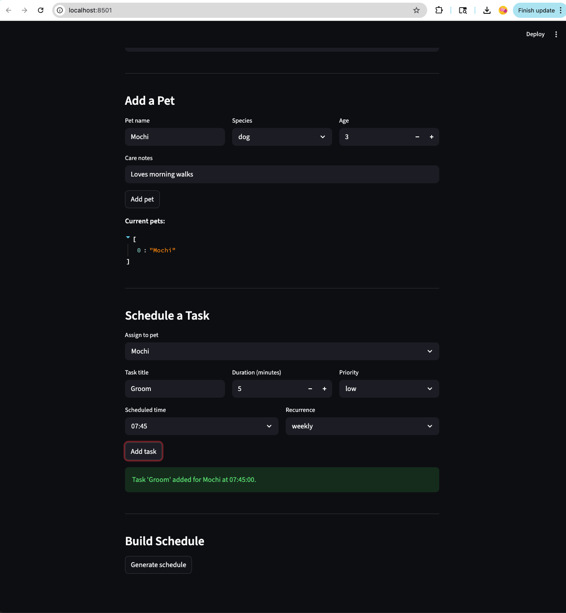
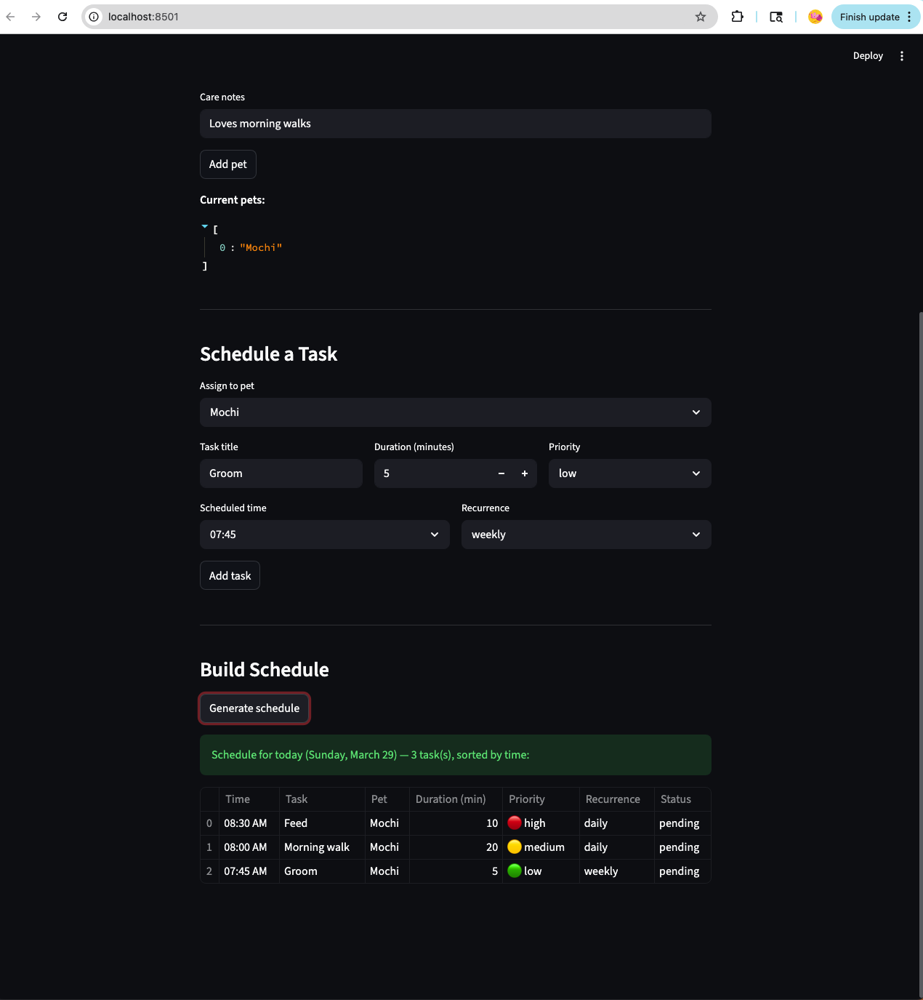

# PawPal+ (Module 2 Project)

You are building **PawPal+**, a Streamlit app that helps a pet owner plan care tasks for their pet.

## Scenario

A busy pet owner needs help staying consistent with pet care. They want an assistant that can:

- Track pet care tasks (walks, feeding, meds, enrichment, grooming, etc.)
- Consider constraints (time available, priority, owner preferences)
- Produce a daily plan and explain why it chose that plan

Your job is to design the system first (UML), then implement the logic in Python, then connect it to the Streamlit UI.

## What you will build

Your final app should:

- Let a user enter basic owner + pet info
- Let a user add/edit tasks (duration + priority at minimum)
- Generate a daily schedule/plan based on constraints and priorities
- Display the plan clearly (and ideally explain the reasoning)
- Include tests for the most important scheduling behaviors

## Getting started

### Setup

```bash
python -m venv .venv
source .venv/bin/activate  # Windows: .venv\Scripts\activate
pip install -r requirements.txt
```

### Suggested workflow

1. Read the scenario carefully and identify requirements and edge cases.
2. Draft a UML diagram (classes, attributes, methods, relationships).
3. Convert UML into Python class stubs (no logic yet).
4. Implement scheduling logic in small increments.
5. Add tests to verify key behaviors.
6. Connect your logic to the Streamlit UI in `app.py`.
7. Refine UML so it matches what you actually built.

## System Architecture

The class diagram below shows how `Owner`, `Pet`, `Task`, and `Scheduler` relate to each other in the final implementation.

<a href="assets/uml_final.png" target="_blank"></a>

## 📸 Demo

**App on startup:**

<a href="assets/0_before_adding_a_pet.png" target="_blank"></a>

**Adding a pet:**

<a href="assets/add_a_pet.png" target="_blank"></a>

**Adding tasks — success and conflict warning:**

<a href="assets/add_task_1_at_8am_20min_success.png" target="_blank"></a>

<a href="assets/add_task_2_at_815am_10min_conflict.png" target="_blank"></a>

<a href="assets/add_task_3_at_830am_10min_success.png" target="_blank"></a>

<a href="assets/add_task_4_at_745_5min_success.png" target="_blank"></a>

**Generated schedule sorted by priority:**

<a href="assets/generate_schedule.png" target="_blank"></a>

## Smarter Scheduling

PawPal+ includes algorithmic features that make scheduling more intelligent:

- **Priority-based scheduling** — `generate_daily_schedule()` sorts tasks by priority first (🔴 high → 🟡 medium → 🟢 low), then by scheduled time as a tiebreaker. High-priority tasks always appear at the top of the daily plan regardless of when they are scheduled.
- **Sorting** — Tasks are sorted by scheduled time (earliest first) using `Scheduler.sort_by_time()`.
- **Filtering** — Tasks can be filtered by pet name (`filter_by_pet()`) or completion status (`filter_by_status()`), making it easy to view only what's relevant.
- **Recurring tasks** — Tasks can be marked as `"daily"` or `"weekly"`. When completed via `Scheduler.mark_task_complete()`, the next occurrence is automatically scheduled using Python's `timedelta`.
- **Conflict detection** — `Scheduler.add_task()` checks all existing tasks across all pets for time overlaps before adding a new task. If a conflict is found, a descriptive warning message is returned instead of silently skipping or crashing.

## Optional Extension: Challenge 3 — Advanced Priority Scheduling

This project implements **Challenge 3: Advanced Priority Scheduling and UI**.

`generate_daily_schedule()` was updated to sort tasks by priority first (high → medium → low), using scheduled time as a tiebreaker when two tasks share the same priority. The Streamlit schedule table was updated to display color-coded priority emojis (🔴 high, 🟡 medium, 🟢 low) making it immediately clear which tasks need the most attention. A new test `test_generate_daily_schedule_sorts_by_priority_then_time` was added to verify the priority sort logic independently of the time sort.

## Testing PawPal+

### How to run tests

```bash
python -m pytest tests/test_pawpal.py -v
```

### What the tests cover

| Test                                                       | What it verifies                                                            |
| ---------------------------------------------------------- | --------------------------------------------------------------------------- |
| `test_task_completion_changes_status`                      | `complete()` flips status from `pending` to `completed`                     |
| `test_add_task_increases_pet_task_count`                   | Adding a task to a pet increments its task list                             |
| `test_sort_by_time_returns_chronological_order`            | `sort_by_time()` returns tasks earliest-first regardless of insertion order |
| `test_generate_daily_schedule_sorts_by_priority_then_time` | High priority tasks appear before lower priority ones; time breaks ties     |
| `test_generate_daily_schedule_is_sorted`                   | `generate_daily_schedule()` returns today's tasks in time order             |
| `test_daily_task_schedules_next_day`                       | Completing a daily task auto-creates the next occurrence 1 day later        |
| `test_weekly_task_schedules_next_week`                     | Completing a weekly task auto-creates the next occurrence 7 days later      |
| `test_non_recurring_task_returns_none`                     | Completing a one-time task returns `None` (no follow-up created)            |
| `test_add_task_detects_overlap`                            | Overlapping tasks trigger a `CONFLICT` warning and are not added            |
| `test_add_task_no_conflict_when_sequential`                | Back-to-back tasks with no overlap are both added successfully              |
| `test_scheduler_handles_pet_with_no_tasks`                 | A pet with zero tasks does not crash `generate_daily_schedule`              |

### Confidence level

★★★★★ — All 11 tests pass. Core behaviors (priority scheduling, sorting, recurrence, conflict detection) and edge cases (empty task list, non-recurring tasks) are verified.
