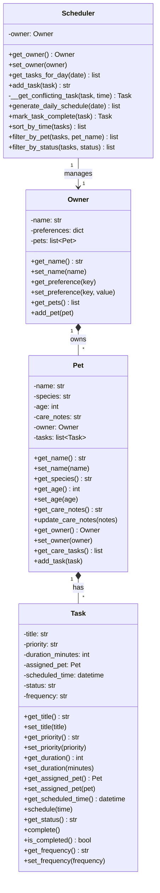

# PawPal+ UML Class Diagram

```mermaid
classDiagram
    class Owner {
        -name: str
        -preferences: dict
        -pets: list~Pet~
        +get_name() str
        +set_name(name)
        +get_preference(key)
        +set_preference(key, value)
        +get_pets() list
        +add_pet(pet)
    }

    class Pet {
        -name: str
        -species: str
        -age: int
        -care_notes: str
        -owner: Owner
        -tasks: list~Task~
        +get_name() str
        +set_name(name)
        +get_species() str
        +get_age() int
        +set_age(age)
        +get_care_notes() str
        +update_care_notes(notes)
        +get_owner() Owner
        +set_owner(owner)
        +get_care_tasks() list
        +add_task(task)
    }

    class Task {
        -title: str
        -priority: str
        -duration_minutes: int
        -assigned_pet: Pet
        -scheduled_time: datetime
        -status: str
        -frequency: str
        +get_title() str
        +set_title(title)
        +get_priority() str
        +set_priority(priority)
        +get_duration() int
        +set_duration(minutes)
        +get_assigned_pet() Pet
        +set_assigned_pet(pet)
        +get_scheduled_time() datetime
        +schedule(time)
        +get_status() str
        +complete()
        +is_completed() bool
        +get_frequency() str
        +set_frequency(frequency)
    }

    class Scheduler {
        -owner: Owner
        +get_owner() Owner
        +set_owner(owner)
        +get_tasks_for_day(date) list
        +add_task(task) str
        -__get_conflicting_task(task, time) Task
        +generate_daily_schedule(date) list
        +mark_task_complete(task) Task
        +sort_by_time(tasks) list
        +filter_by_pet(tasks, pet_name) list
        +filter_by_status(tasks, status) list
    }

    Owner "1" *-- "*" Pet : owns
    Pet "1" *-- "*" Task : has
    Scheduler "1" --> "1" Owner : manages
```
